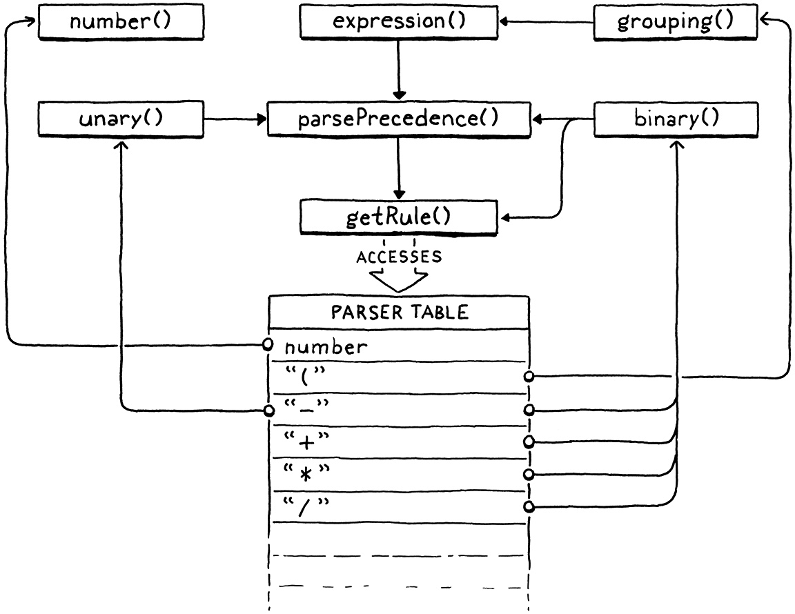

# Garkatron CLOX Implementation

### Chunks of Bytecode

#### isn't memory efficient

JLOX isn't memory efficient because a simple expression turns into a big collection of objects overcharged with Java Objects data.

The CPUs process works faster than RAM, so it uses the cache to compenste.
Every time that CPU reads bytes keep a little part of data in the cache to read later.
If we keep some data in the cache and then read from it, our program will be faster as a roadrunner.
JVM Object header tends to pull out of the ram our data becous tends to push objects away from each other.

#### Compiling issues

Performance has a cost:
Less portability (LLVM's help's)
Harder work (Includes LLVM's)


#### Bytecode

Bytecode it's a collection of custom instructions to handle our data around the memory without think about specific instrucion set of the target machine.
It's a simple way to transform native instructions to our simple instructions and handle it by our own.
It's portable if we write it in C or another compiled language and it's faster than a tree-walk interpreter.


#### A dynamic array of instructions

We don't know about the size of the array before start compilink a chunk, so it must be dynamic.

Cache friendly, dense storage
constant time indexed element lookup
constat tie appending to the end of the array

**how works?:**

Allocate a new array with more capacity.
Copy the existing elements from the old array to the new one.
Store the new capacity.
Delete the old array.
Update code to point to the new array.
Store the element in the new array now that there is room.
Update the count.

#### Disassembler

A debug tool to see the bytecode generated by our chunk.

#### Constants

For small fixed-size values like integers, many instruction sets store the value directly in the code stream right after the opcode. These are called immediate instructions because the bits for the value are immediately after the opcode.
These constants are saved in a separated "constant data" region in the binary.
Then it's loaded with it's memory address.

JVM associates a constant pool for each compiled class.
In CLOX we store all constants on it.

When VM execute a OP_CONSTANT it loads the data for the usage.
Each OPCODE has its own operands and its hown format.


#### Line Information

In jlox line info lives in tokens, in clox lives in an array in the code chunks. Inneficient but easy.

#### Value arrays


#### Challenges
https://danluu.com/malloc-tutorial/
https://github.com/danluu/malloc-tutorial

https://mliezun.github.io/2020/04/11/custom-malloc.html

1. How works reallocate(), malloc() and free();
https://medium.com/@andrestc/implementing-malloc-and-free-ba7e7704a473


https://tharikasblogs.blogspot.com/p/how-to-write-your-own-malloc-and-free.html

#### 15 . 1 An Instruction Execution Machine

The choice to have a static VM instance is a concession for the book, but not necessarily a sound engineering choice for a real language implementation. If you’re building a VM that’s designed to be embedded in other host applications, it gives the host more flexibility if you do explicitly take a VM pointer and pass it around.

That way, the host app can control when and where memory for the VM is allocated, run multiple VMs in parallel, etc.

What I’m doing here is a global variable, and everything bad you’ve heard about global variables is still true when programming in the large. But when keeping things small for a book . . . 

#### 15 . 2 A Value Stack ManipulatorIn 
https://craftinginterpreters.com/a-virtual-machine.html#:~:text=A%20Value%20Stack%20Manipulator

#### Challenges
1.What bytecode instruction sequences would you generate for the following expressions:

```c
 // .1

   // 3 + 2 * 1

   // 3
   writeConstant(&chunk, 3, 0);

   // 2
   writeConstant(&chunk, 2, 0);

   // 1
   writeConstant(&chunk, 1, 0);

   // *
   writeChunk(&chunk, OP_MULTIPLY, 0);

   // +
   writeChunk(&chunk, OP_ADD, 0);

   // return
   writeChunk(&chunk, OP_RETURN, 0);
```

2.If we really wanted a minimal instruction set, we could eliminate either OP_NEGATE or OP_SUBTRACT. Show the bytecode instruction sequence you would generate for:


To substract a number we could negate the number and the add to the other number.

To negate a number without negate we could substract the double of the current amount

#### Scanning on demand
#### Challenges
https://craftinginterpreters.com/scanning-on-demand.html#challenges

1.

TOKEN_STRING_START
TOKEN_INTERP_START

TOKEN_STRING_START      "
TOKEN_STRING_TEXT       "Nested "
TOKEN_INTERP_START      ${
TOKEN_STRING_START      "
TOKEN_STRING_TEXT       "interpolation?! Are you "
TOKEN_INTERP_START      ${
TOKEN_STRING_START      "
TOKEN_STRING_TEXT       "mad?!"
TOKEN_STRING_END        "
TOKEN_INTERP_END        }
TOKEN_STRING_END        "
TOKEN_INTERP_END        }
TOKEN_STRING_END        "

2.

Java never needed to backtrack or re-tokenize like old C++ did.

The generic grammar was designed to be unambiguous and context-aware from the beginning.

C# generics are parsed contextually, and its parser knows that inside generic type argument lists, >> should be treated as two >s.

The tokenizer does not combine >> in generic contexts.

Parsing rules for type arguments are distinct from expressions, so >> is not interpreted as an operator here.

3.
https://howtodoinjava.com/java/basics/java-keywords/#:~:text=3.-,Contextual%20Keywords,-The%20following%2016 

#### Compiling Expressions


##### Challenges

1. To really understand the parser, you need to see how execution threads through the interesting parsing functions—parsePrecedence() and the parser functions stored in the table. Take this (strange) expression:
  1. expression()
    2. parsePrecedence()
      3. advance()
      4. getRule()
    5. prefixRule()
    (Optional) 6. getRule()
    (Optional) 7. advance()
    (Optional) 8. getRule()
    (Optional) 9. infixRule()
  
  1. Grouping()
   2. Unary()
   3. binary()
   4. Unary()
   3. binary()
   3. binary()
   3. binary()

```scss
expression()
  └── parsePrecedence(PREC_ASSIGNMENT)
        └── advance() → (
        └── grouping()
              └── expression()
                    └── parsePrecedence(PREC_ASSIGNMENT)
                          └── advance() → -
                          └── unary()
                                └── parsePrecedence(PREC_UNARY)
                                      └── advance() → 1
                                      └── number()
                          └── binary() for +
                                └── parsePrecedence(PREC_FACTOR)
                                      └── advance() → 2
                                      └── number()
        └── binary() for *
              └── parsePrecedence(PREC_FACTOR)
                    └── advance() → 3
                    └── number()
        └── binary() for -
              └── parsePrecedence(PREC_FACTOR)
                    └── advance() → -
                    └── unary()
                          └── parsePrecedence(PREC_UNARY)
                                └── advance() → 4
                                └── number()
```

2.

+ (optional prefix), infix

3.
*implemented*

#### Two new types
##### Challenges

1. We could reduce our binary operators even further than we did here. Which other instructions can you eliminate, and how would the compiler cope with their absence?
      
- we can delete Multiplication and replace with add secuence

2. Conversely, we can improve the speed of our bytecode VM by adding more specific instructions that correspond to higher-level operations. What instructions would you define to speed up the kind of user code we added support for in this chapter?

- list:
- 0.0 to 5.0
- 0.0 to -5.0
- != >= <=

#### Strings
##### Challenges
https://craftinginterpreters.com/strings.html#challenges

3.
I'll convert the other value to a string, because it's a common approach (Java, Python, C#) except for objecs (hashtables), the user will use a special function to convert it's own object to a string (more custom) (optional (default function pre created)).

#### Design Note: String Encoding
[Wren language](https://wren.io)

#### Hash tables

If you’d like to learn more (and you should, because some of these are really cool), look into “double hashing”, “cuckoo hashing”, “Robin Hood hashing”, and anything those lead you to.

